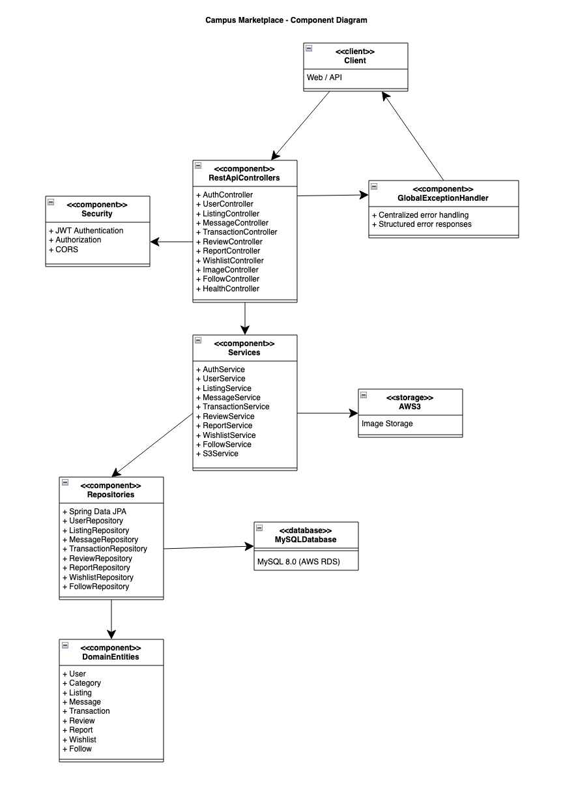

# Campus Marketplace - Spring Boot Application

A comprehensive campus marketplace application built with Spring Boot that allows students to buy and sell items within their campus community.

## Features

- **User Management**: User registration, authentication, and role-based access control
- **Category Management**: Organize items into categories
- **Listing Management**: Create, update, and manage product listings
- **Wishlist**: Save items for later purchase
- **Messaging System**: Communication between buyers and sellers
- **Transaction Management**: Handle purchases and payments
- **Review System**: Rate and review completed transactions
- **Reporting System**: Report inappropriate content or users
- **Admin Panel**: Administrative functions for moderators

## Technology Stack

- **Backend**: Spring Boot 3.3.2
- **Database**: MySQL 8.0
- **ORM**: Spring Data JPA with Hibernate
- **Migration**: Flyway
- **Documentation**: SpringDoc OpenAPI (Swagger)
- **Build Tool**: Maven
- **Java Version**: 17

## Prerequisites

- Java 17 or higher
- Maven 3.6 or higher
- MySQL 8.0 or higher
- Git

## Installation & Setup

### 1. Clone the Repository
```bash
git clone https://github.com/gopinathsjsu/cmpe202-02-team-project-commitstorm.git
cd cmpe202-02-team-project-commitstorm
```

### 2. Database Setup
The application is configured to use AWS RDS MySQL database.

The database connection is already configured in `backend/src/main/resources/application.yml`. No additional setup is required.

### 3. Run the Application

#### Option 1: Using the startup script
```bash
cd backend
./start.sh
```

#### Option 2: Using Maven directly
```bash
cd backend
mvn clean compile
mvn spring-boot:run
```

#### Option 3: Using Docker (for local development only)
```bash
cd backend
docker-compose up
```

## API Documentation

Once the application is running, you can access:

- **Swagger UI**: http://localhost:8080/swagger-ui.html (local) / http://alb-cmpmarket-public-1403545222.us-west-2.elb.amazonaws.com/swagger-ui.html (production)
- **API Docs**: http://localhost:8080/api-docs (local) / http://alb-cmpmarket-public-1403545222.us-west-2.elb.amazonaws.com/api-docs (production)
- **Health Check**: http://localhost:8080/health (local) / http://alb-cmpmarket-public-1403545222.us-west-2.elb.amazonaws.com/api/health (production)

## API Endpoints

The application provides REST APIs for all major operations:

### Core Entities
- **Users**: `/api/users` - User management
- **Categories**: `/api/categories` - Category management
- **Listings**: `/api/listings` - Product listings
- **Images**: `/api/images` - Image upload and management
  - `POST /api/images/presigned-url` - Get presigned URL for upload
  - `POST /api/images/confirm-upload` - Confirm upload and make public
  - `GET /api/images/presigned-get-url` - Get presigned URL for viewing
- **Wishlist**: `/api/wishlist` - User wishlists
- **Messages**: `/api/messages` - Communication system
- **Transactions**: `/api/transactions` - Purchase management
- **Reviews**: `/api/reviews` - Rating and review system
- **Reports**: `/api/reports` - Content moderation

For detailed API documentation, see [API_DOCUMENTATION.md](API_DOCUMENTATION.md)

## Database Schema

The application uses the following main entities:
- `users` - User accounts and profiles
- `categories` - Product categories
- `listings` - Product listings
- `wishlist` - User wishlist items
- `messages` - Communication between users
- `reports` - Content and user reports
- `transactions` - Purchase transactions
- `reviews` - Product and seller reviews

## UML Diagrams

### Deployment Diagram


*Shows the overall system architecture including AWS infrastructure components, Docker containers, and external service integrations.*

### Component Diagram


*Displays the high-level software components and their interactions, showing how different modules communicate within the system.*

## Configuration

Key configuration options in `application.yml`:
- Database connection settings
- Server port (default: 8080)
- Logging levels
- Swagger documentation settings

## Development

### Project Structure
```
backend/
├── src/main/java/com/campus/marketplace/
│   ├── entity/          # JPA entities
│   ├── repository/      # Data access layer
│   ├── service/         # Business logic
│   ├── controller/      # REST controllers
│   ├── dto/            # Data transfer objects
│   ├── exception/      # Exception handling
│   └── config/         # Configuration classes
├── src/main/resources/
│   ├── application.yml  # Application configuration
│       ├── migration/   # Database migrations
│       └── testing/     # Database testing scripts
└── pom.xml              # Maven dependencies
```

### Adding New Features
1. Create entity classes in `entity/` package
2. Add repository interfaces in `repository/` package
3. Implement business logic in `service/` package
4. Create REST controllers in `controller/` package
5. Add DTOs in `dto/` package for request/response handling

## Testing

The application includes comprehensive test coverage with 33 test files across unit, integration, and security tests.

### Prerequisites
- Java 17+, Maven 3.6+, Docker (for integration tests)

### Running Tests

```bash
cd backend

# Run all tests
mvn test

# Run with coverage report
mvn test jacoco:report
# View report at: backend/target/site/jacoco/index.html

# Skip integration tests (faster)
mvn test -Dtest="!*IntegrationTest*"
```

### Test Structure
- **Integration Tests** (13 files): Full API testing with Testcontainers MySQL
- **Controller Tests** (12 files): REST endpoint validation
- **Service Tests** (4 files): Business logic unit tests
- **Config Tests** (2 files): Configuration validation
- **Exception Tests** (1 file): Error handling
- **Util Tests** (1 file): Utility functions

### Manual Testing
- **Postman Collection**: `Campus Marketplace API.postman_collection.json`
- **Swagger UI**: http://localhost:8080/swagger-ui.html
- **Load Tests**: `backend/scripts/load-tests/k6-*.js`

For detailed testing instructions, see **[TESTING.md](Resources/TESTING.md)**.


## 🚀 Production Deployment

### AWS Architecture Overview

```
┌─────────────────┐     ┌──────────────────────┐     ┌─────────────────┐
│   Internet      │────▶│  Application Load    │────▶│   Target Group  │
│   Users         │     │  Balancer (ALB)      │     │   (Port 8080)   │
└─────────────────┘     └──────────────────────┘     └─────────────────┘
                                │                                 │
                                │                                 ▼
                                │                       ┌─────────────────┐
                                │                       │   EC2 Instance  │
                                │                       │   (Docker)      │
                                ▼                       │                 │
                      ┌──────────────────────┐          │  ┌────────────┐ │
                      │   Security Groups    │          │  │ Spring Boot│ │
                      │                      │          │  │   App      │ │
                      │ • ALB Security Group │          │  │ (Port 8080)│ │
                      │   - Inbound: 80,443  │          │  └────────────┘ │
                      │   - Outbound: All    │          └─────────────────┘
                      │                      │
                      │ • EC2 Security Group │                   │
                      │   - Inbound: 8080    │                   ▼
                      │     (from ALB only)  │         ┌─────────────────┐
                      │   - Outbound: All    │         │   AWS RDS       │
                      └──────────────────────┘         │   MySQL 8.0     │
                                                       │   Database      │
                                                       └─────────────────┘
```

### Infrastructure Components

#### **Application Load Balancer (ALB)**
- **Type**: Application Load Balancer
- **Listeners**: HTTP (80) and HTTPS (443)
- **Target Groups**: 
  - Protocol: HTTP
  - Port: 8080
  - Health Check: `/api/health`
  - Healthy threshold: 2
  - Unhealthy threshold: 2
  - Timeout: 5 seconds
  - Interval: 30 seconds

#### **Security Groups**
- **ALB Security Group**:
  - Inbound: HTTP (80), HTTPS (443) from 0.0.0.0/0
  - Outbound: All traffic to 0.0.0.0/0

- **EC2 Security Group**:
  - Inbound: HTTP (8080) from ALB Security Group only
  - Outbound: All traffic to 0.0.0.0/0

#### **EC2 Instance**
- **AMI**: Amazon Linux 2 or Ubuntu
- **Instance Type**: t3.micro (for development) or t3.small+ (for production)
- **Storage**: 20GB+ EBS
- **Docker**: Pre-installed and configured

#### **RDS MySQL Database**
- **Engine**: MySQL 8.0
- **Instance Class**: db.t3.micro (development) or db.t3.small+ (production)
- **Storage**: 20GB+ with auto-scaling
- **Multi-AZ**: Enabled for production
- **Backup**: Automated daily backups

### Deployment Process

#### Prerequisites
- AWS Account with appropriate permissions
- EC2 instance with Docker installed
- RDS MySQL database created
- ALB configured with target groups
- Security groups properly configured

#### Environment Variables
Create a `.env` file in the `backend/` directory:

```bash
# Database Configuration
SPRING_DATASOURCE_URL=your-db-url
SPRING_DATASOURCE_USERNAME=your-db-username
SPRING_DATASOURCE_PASSWORD=your-db-password

# AWS S3 Configuration (for image uploads)
AWS_ACCESS_KEY_ID=your-aws-access-key
AWS_SECRET_ACCESS_KEY=your-aws-secret-key
AWS_S3_BUCKET_NAME=your-s3-bucket-name
AWS_REGION=us-west-2

# OpenAI Configuration (for chatbot)
OPENAI_API_KEY=your-openai-api-key

# Server Configuration
SERVER_PORT=8080
```


### Deployment Scripts
Added doc on deployment in Resources.

#### AWS Cloud Infrastructure (Manual Console Deployment)
The application is deployed on AWS using manually configured resources through the AWS Management Console:

**Infrastructure Components:**
- **Application Load Balancer (ALB)**: `alb-cmpmarket-public-1403545222.us-west-2.elb.amazonaws.com`
- **EC2 Instance**: Amazon Linux 2 with Docker, running Spring Boot application
- **RDS MySQL Database**: MySQL 8.0 instance for data persistence
- **S3 Bucket**: For image storage with presigned URLs
- **Security Groups**: Properly configured for secure communication
- **VPC**: Isolated network with public/private subnets

**Key Configurations:**
- ALB forwards HTTP traffic to EC2 instance on port 8080
- Health checks configured for `/api/health` endpoint
- Database security group restricts access to EC2 instances only
- Application runs in Docker container with environment variables

### Monitoring & Observability

#### Health Checks
- **Application Health**: `/api/health` endpoint
- **Database Connectivity**: Automatic in health check
- **ALB Target Health**: Configured in target group


#### Postman Collection
- **Full Collection**: `Campus Marketplace API.postman_collection.json`
- **Smoke Tests**: `backend/postman/Smoke_Test_Collection.json`
- Import into Postman and set `base_url` variable

#### Load Testing
```bash
# Install k6
brew install k6

# Run smoke test (basic functionality)
k6 run backend/scripts/load-tests/k6-smoke-test.js

# Run load test (performance under load)
k6 run --vus 50 --duration 2m backend/scripts/load-tests/k6-load-test.js

# For production testing, set BASE_URL environment variable:
# BASE_URL=http://alb-cmpmarket-public-1403545222.us-west-2.elb.amazonaws.com k6 run backend/scripts/load-tests/k6-smoke-test.js
```

## Resources

The `Resources/` folder contains all project documentation, diagrams, testing materials, and development artifacts:

### Deployment/
Contains AWS infrastructure setup documentation, health check screenshots, and deployment instructions for EC2, RDS, ALB, and security groups.

### Diagrams/
Contains UML diagrams including:
- Deployment diagrams showing AWS architecture
- Class diagrams illustrating application structure
- Component diagrams showing system interactions

### docs/
Contains comprehensive project documentation including:
- API documentation
- Authentication guides
- Testing procedures
- Deployment guides

### Postman/
Contains Postman collections for API testing:
- Complete API test suites
- Smoke test collections
- Environment configurations

### Scrum/
Contains project management artifacts:
- Project journal with all scrum meeting records
- Burndown chart tracking sprint progress
- Trello board details and task management
- XP core values followed throughout the project

### TestResults/
Contains screenshots and evidence of test executions:
- Unit test results
- Integration test results
- Load testing performance metrics
- Test coverage reports

### Wireframes/
Contains UI/UX design artifacts:
- User interface wireframes
- User experience mockups
- Design system documentation
- Added Authentication Page
- Landing page
- Chat layout
- Listing Creation, Viewing
- Edit/Delete Listing


## License

This project is part of CMPE 202 coursework.

## Team

- Sonali Lonkar
- Sofia Silva
- Shivani Jariwala
- Alex Huang

## Contribution

### Sonali Lonkar:
- Set up the basic project structure
- Added APIs for Listings, Auth and Login, Transactions, Reports, Reviews
- Created APIs postman collection and shared with team
- Added Image handling and s3 setup
- Added messages on event updates
- Added Follow seller endpoint
- Added unit, integration and load tests
- Added helper docs for auth, testing, API, deployment guides
- Deployed the backend with docker, to AWS to EC2, security groups, target groups, load balancers etc
- Prepared the deployment and class diagram
- Updated Readme file gradually as we added APIs

### Sofia Silva:
- For this project I worked on establishing the Database schema and AWS RDS
- Also worked on testing the API's Sonali created
- Implemented the Messaging APIs, Wishlist API
- Implemented Chabot Search Functionality
- Added Admin Control
- Implemented some unit tests for backend
- Worked on S3
- Fixed bugs for S3, Report, Listings, and Messages
- Updated Readme gradually


### Shivani Vinodkumar Jariwala:
- Created the initial react app setup
- Developed authentication part (login/ signup/logout)
- Added view my listings, edit my listings, delete listings
- Constructed send and receive messages
- Added buy and sell features in-chat
- Fixed bugs on UI
- Implemented listing component
- Worked on search and filters

### Alex Huang:
- Frontend creation
- Organized and split up tasks for frontend
- Implemented the listing creation process
- Created routing system
- Created Review dashboard
- Connected frontend with chatbot functionality
- Designed layout for multiple UI components
- Created Trello board
- Acted as scrum manager
